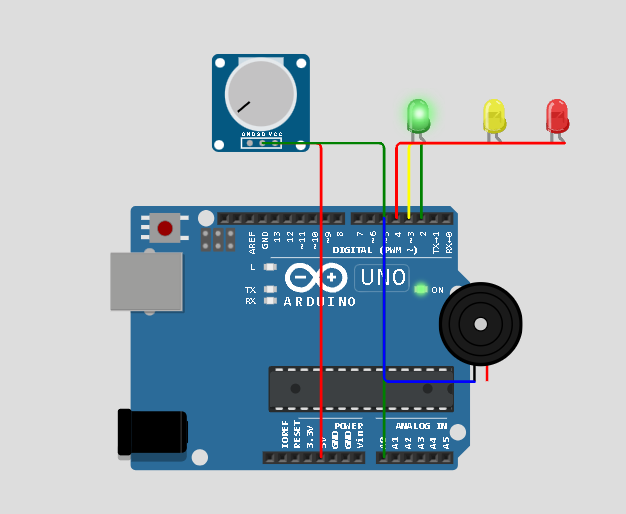

# 🌊 KenzoSafety – Sistema Físico de Monitoramento de Enchentes

## 🚨 Descrição do Problema

As enchentes urbanas têm causado enormes prejuízos materiais e sociais em regiões periféricas brasileiras, onde o déficit de infraestrutura de drenagem é crítico. Com o agravamento das mudanças climáticas, o monitoramento preventivo em áreas de risco se torna essencial para evitar perdas humanas e patrimoniais.

---

## 💡 Visão Geral da Solução

O **KenzoSafety** é um sistema físico de monitoramento em tempo real, desenvolvido com **Arduino UNO** no simulador **Wokwi**, que utiliza sensores para identificar o nível da água e emitir alertas visuais e sonoros. A solução visa alertar os moradores e permitir ações rápidas para mitigar danos causados por alagamentos.

---

## 🛠️ Componentes Utilizados

- Arduino UNO
- Potenciômetro (simulando sensor de nível de água)
- 3 LEDs (Verde, Amarelo, Vermelho)
- Buzzer (alarme sonoro)
- Resistores (opcional no simulador, obrigatório na prática)
- Fios de conexão

---

## 📋 Lógica de Funcionamento

| Nível da água | LED      | Alarme            | Ação sugerida                |
|---------------|----------|-------------------|-------------------------------|
| Baixo         | Verde    | Nenhum            | Situação normal               |
| Moderado      | Amarelo  | Beep intermitente | Atenção – risco iminente      |
| Alto          | Vermelho | Alarme contínuo   | Alerta máximo – evacuação     |

---

## 🔁 Simulação no Wokwi

### ✅ [Clique aqui para abrir o projeto no Wokwi](https://wokwi.com/projects/432309563860231169)

1. Use o **potenciômetro** para simular o nível da água.
2. Observe os **LEDs mudando de cor** conforme o valor lido.
3. Ouça o **buzzer ativando** em nível crítico.

---

## 🎥 Vídeo Demonstrativo

### ▶️ [Assista ao vídeo explicativo do projeto](https://youtu.be/ghhzjrXil58)

Neste vídeo de até 3 minutos, mostramos:
- O problema enfrentado
- A importância da solução
- Como o circuito funciona
- A simulação em tempo real no Wokwi

---

## 🔧 Circuito do Projeto

O circuito foi desenvolvido utilizando o simulador **Wokwi** e é composto por:

- **Potenciômetro** (simulando o nível de água)
- **3 LEDs** (verde, amarelo e vermelho para sinalização de risco)
- **Buzzer** (alerta sonoro)

A imagem abaixo representa a montagem completa do sistema:

---

## 📁 Estrutura do Projeto

/
├── sketch.ino # Código-fonte do Arduino

├── diagram.json # Configuração dos componentes no simulador

├── README.md # Documentação do projeto

└── assets/

  └── circuito.png 

---

## 👨‍💻 Desenvolvido por

- **Fernando Kenzo**
- **Marcello Lassalla**  
- FIAP – Global Solution 2025  
- Disciplina: Edge Computing & IoT  
